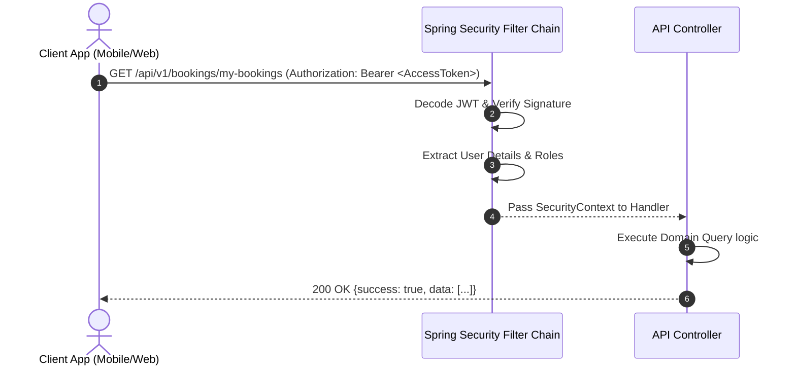

# Authentication Flows

Version: 1.0

Status: Approved

Author: Vi Quy

Reviewer: ChatGPT (Tech Lead)

---

# 1. Login & Token Retrieval Flow

This diagram illustrates how client applications authenticate and store the tokens.

```mermaid
sequenceDiagram
    autonumber
    actor Client as Client App (Mobile/Web)
    participant API as Gateway / Auth Controller
    database DB as MySQL DB

    Client->>API: POST /api/v1/auth/login {email, password}
    API->>DB: Query user credentials
    DB-->>API: User entity & hashed password
    API->>API: Verify BCrypt match
    API->>API: Generate AccessToken (15m expiration)
    API->>API: Generate RefreshToken (7d expiration)
    API->>DB: Save RefreshToken details (UUID, user_id, expired_at)
    API-->>Client: 200 OK {accessToken, refreshToken, tokenType}
    Note over Client: Store tokens in secure storage<br/>(e.g., Flutter Secure Storage)
```

---

# 2. Authenticated API Call Flow

Once authenticated, the client includes the JWT access token in all requests.



---

# 3. Token Expiry & Automatic Refresh Flow

When an access token expires (indicated by a 401 Unauthorized response from the API), the client uses the stored refresh token to silently request a new access token without interrupting the user.

```mermaid
sequenceDiagram
    autonumber
    actor Client as Client App (Mobile/Web)
    participant Sec as Spring Security Filter Chain
    participant API as Auth Controller
    database DB as MySQL DB

    Client->>Sec: GET /api/v1/bookings/my-bookings (Authorization: Bearer <ExpiredAccessToken>)
    Sec->>Sec: Validate Signature (Expired)
    Sec-->>Client: 401 Unauthorized (AUTH_002: Token Expired)
    
    Note over Client: Catch 401 & Trigger Silent Token Refresh
    
    Client->>API: POST /api/v1/auth/refresh {refreshToken}
    API->>DB: Query refresh token details
    DB-->>API: Active token entity
    API->>API: Verify expiration & status
    API->>API: Generate New AccessToken
    API->>API: Generate New RefreshToken (Rotate)
    API->>DB: Revoke old token & Save new token
    API-->>Client: 200 OK {accessToken, refreshToken}
    
    Note over Client: Update secure storage with new tokens
    
    Client->>Sec: GET /api/v1/bookings/my-bookings (Authorization: Bearer <NewAccessToken>)
    Sec->>Sec: Validate (Success)
    Sec-->>Client: 200 OK {success: true, data: [...]}
```
