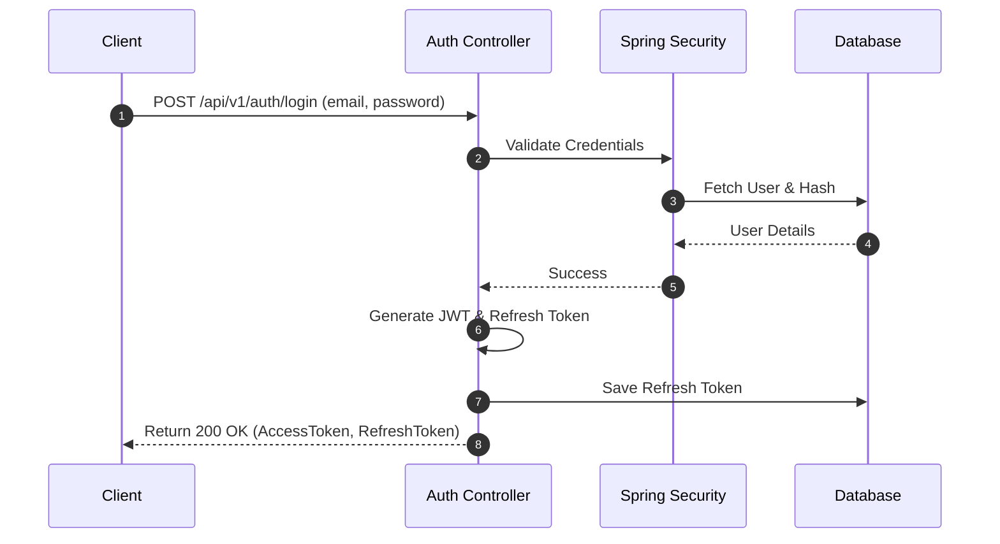

# Security Design

Version: 1.0

Status: Approved

Author: Vi Quy

Reviewer: ChatGPT (Tech Lead)

---

# 1. Purpose

This document details the security design for the BookSmart platform. It describes how user identities are authenticated, how resource access is authorized, and how sensitive data is protected.

---

# 2. Authentication Architecture

BookSmart implements stateless session management using **JSON Web Tokens (JWT)**.

### Access Token
*   **Type**: JWT (HMAC-SHA256 signature).
*   **Expiration**: 15 minutes.
*   **Payload**: Contains user id, email, role, and expiration timestamp.
*   **Transmission**: Passed in the HTTP `Authorization` header as a Bearer token (`Authorization: Bearer <token>`).

### Refresh Token
*   **Type**: Random UUID string or high-entropy secure string.
*   **Expiration**: 7 days.
*   **Storage**: Saved in the database linked to the user account.
*   **Rotation**: When a new JWT is requested, the refresh token is rotated (the old one is invalidated, and a new one is returned to the client) to prevent replay attacks.

---

# 3. Password Security

All user passwords must be hashed before storage.
*   **Algorithm**: **BCrypt**.
*   **Work Factor (Strength)**: 10 (or higher, depending on performance benchmarks).
*   **Implementation**: Spring Security's `BCryptPasswordEncoder`.
*   **Constraint**: Raw passwords are never printed in logs or sent in response payloads.

---

# 4. Role-Based Access Control (RBAC)

The platform supports four roles: `CUSTOMER`, `BUSINESS_OWNER`, `EMPLOYEE`, and `ADMIN`. The following matrix maps roles to API resource modules:

| API Module | Public Access | Customer | Business Owner | Employee | Admin |
|------------|---------------|----------|----------------|----------|-------|
| `/api/v1/auth/**` (Login/Register) | Yes | Yes | Yes | Yes | Yes |
| `/api/v1/businesses` (Read) | Yes | Yes | Yes | Yes | Yes |
| `/api/v1/businesses` (Write) | No | No | Yes | No | Yes (Suspend/Audit) |
| `/api/v1/branches/**` (Write) | No | No | Yes | No | No |
| `/api/v1/bookings` (Create/View history) | No | Yes | Yes (View own) | Yes (View own) | Yes (View all) |
| `/api/v1/bookings` (Manage status) | No | Yes (Cancel) | Yes (Confirm/Complete) | Yes (Check-in/Progress) | Yes |
| `/api/v1/payments/**` | No | Yes (Pay/History) | Yes (History) | No | Yes (History) |
| `/api/v1/reviews` (Create) | No | Yes (Completed only) | No | No | No |
| `/api/v1/reviews` (Delete) | No | Yes (Own) | No | No | Yes |
| `/api/v1/recommendations/**` | Yes | Yes | Yes | Yes | Yes |
| `/api/v1/admin/**` | No | No | No | No | Yes |

---

# 5. Security Filters & Constraints

### CORS (Cross-Origin Resource Sharing)
*   Allowed Origins: Restricted to client applications (e.g., specific domains and local developer environments).
*   Allowed Methods: `GET`, `POST`, `PUT`, `DELETE`, `OPTIONS`, `PATCH`.

### CSRF (Cross-Site Request Forgery)
*   Disabled since BookSmart uses stateless JWT authentication rather than session cookies.

### HTTP Security Headers
*   Strict-Transport-Security (HSTS) enforced in production.
*   X-Content-Type-Options: `nosniff`.
*   X-Frame-Options: `DENY` (prevents clickjacking).
*   X-XSS-Protection: `1; mode=block`.
