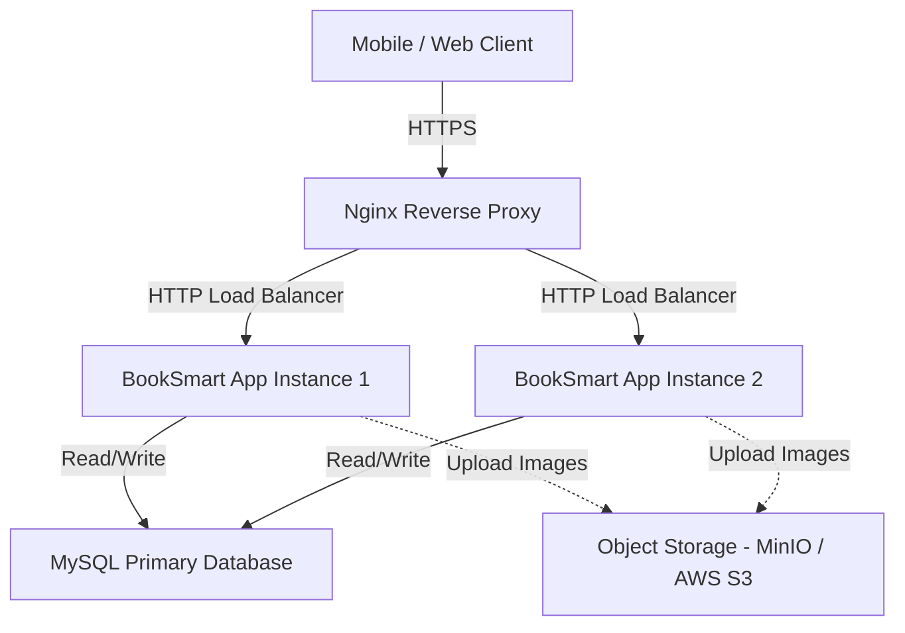

# Deployment Architecture

Version: 1.0

Status: Approved

Author: Vi Quy

Reviewer: ChatGPT (Tech Lead)

---

# 1. Purpose

This document describes the deployment architecture for the BookSmart platform, mapping the application components to physical and containerized infrastructures.

---

# 2. Deployment Environments

BookSmart is designed to support three environments:

*   **Development**: Local developer environments running Spring Boot directly or via Docker containers.
*   **Staging**: A cloud environment (e.g., AWS EC2 or a VPS) mimicking production for integration testing.
*   **Production**: The live environment serving end-users.

---

# 3. Architecture Topology

### Component Details
*   **Nginx**: Acts as the reverse proxy and SSL terminator, routing traffic to the active Spring Boot container(s).
*   **Spring Boot App**: The core application instances, running as stateless Docker containers.
*   **MySQL**: Relational database running on a persistent volume or managed cloud DB service (e.g., AWS RDS).
*   **Object Storage (MinIO / S3)**: For hosting business logos, service images, and check-in proof photos.

---

# 4. Containerization (Docker)

The application is containerized using multi-stage Dockerfiles to optimize image sizes and security.

### Docker Compose Local Setup
A `docker-compose.yml` file is provided in the root directory containing:
1.  **`booksmart-app`**: The backend service, built from the source code.
2.  **`booksmart-db`**: MySQL 8 database service with persistent volume mappings.
3.  **`minio`**: Object storage server simulating S3 locally.

---

# 5. Scalability Paths

To transition from the initial version to a highly scalable platform:

1.  **Database Clustering**: Upgrade from single MySQL to Primary-Replica replication, routing read queries to replicas.
2.  **State Management**: Introduce Redis for session caching, rate limiting, and temporary timeslot locks.
3.  **Asynchronous Tasks**: Deploy Apache Kafka or RabbitMQ to process non-blocking workflows (e.g., sending emails, SMS reminders, and generating recommendation logs).
4.  **Orchestration**: Deploy containerized nodes under Kubernetes (K8s) to manage auto-scaling and rolling deployments.
