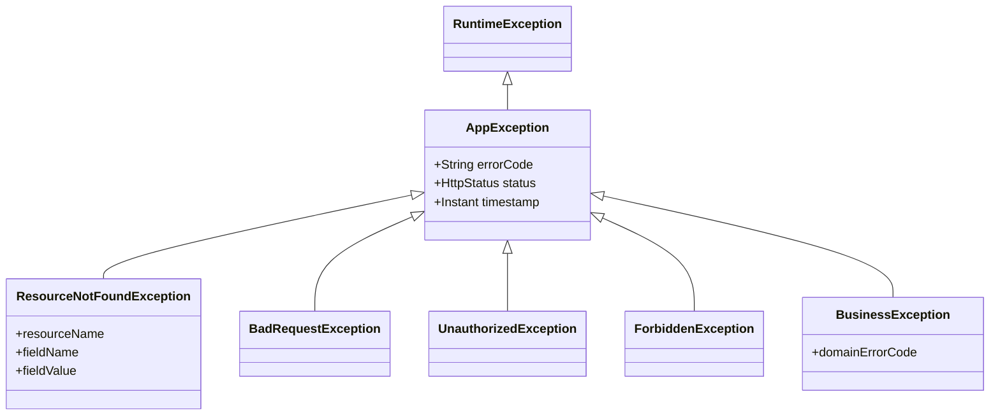

# Exception Handling Strategy

Version: 1.0

Status: Approved

Author: Vi Quy

Reviewer: ChatGPT (Tech Lead)

---

# 1. Purpose

This document describes the exception handling design for the BookSmart platform. It defines how exceptions are caught, logged, and formatted into clean RESTful JSON responses.

---

# 2. Exception Hierarchy

All custom business exceptions extend `AppException`, a subclass of `RuntimeException`.



### Core Custom Exceptions
*   **`ResourceNotFoundException`**: Thrown when a database lookup yields no results (e.g. employee with ID `5` not found). Maps to `HTTP 404 Not Found`.
*   **`BadRequestException`**: Thrown for invalid user inputs that bypass initial validation checks. Maps to `HTTP 400 Bad Request`.
*   **`UnauthorizedException`**: Thrown for invalid tokens or credentials. Maps to `HTTP 401 Unauthorized`.
*   **`ForbiddenException`**: Thrown when role authorization checks fail. Maps to `HTTP 403 Forbidden`.
*   **`BusinessException`**: Thrown when business rules are violated (e.g., booking an already reserved slot, cancelling a booking that is completed). Maps to `HTTP 409 Conflict` or `HTTP 422 Unprocessable Entity`.

---

# 3. Global Exception Handler

Spring Boot utilizes `@RestControllerAdvice` and `@ExceptionHandler` methods to catch exceptions globally.

### Handled Spring System Exceptions
*   **`MethodArgumentNotValidException`**: Handled to parse validation errors on DTO fields and output them as structured field-level messages.
*   **`DataIntegrityViolationException`**: Catches database-level constraints (like double-inserting unique emails) to hide low-level database details and output clean, user-friendly errors.

---

# 4. Standard Error Response Format

All error responses returned to clients follow a uniform structure:

```json
{
  "success": false,
  "message": "Validation failed for the request payload",
  "data": null,
  "errors": {
    "email": "Must be a well-formed email address",
    "password": "Password must be at least 8 characters long"
  },
  "errorCode": "VAL_001",
  "timestamp": "2026-07-17T11:28:32Z"
}
```

### Fields Description
*   **`success`**: Always `false`.
*   **`message`**: A localized, user-friendly error summary.
*   **`data`**: Always `null` on error.
*   **`errors`**: Key-value map representing validation error details (field names vs error descriptions). Optional if not validation-related.
*   **`errorCode`**: Standardized domain-specific code (defined in [error-codes.md](file:///home/van-quy/Workspace/Projects/booksmart/docs/api/10-error-codes.md)).
*   **`timestamp`**: ISO-8601 timestamp of when the error occurred.
